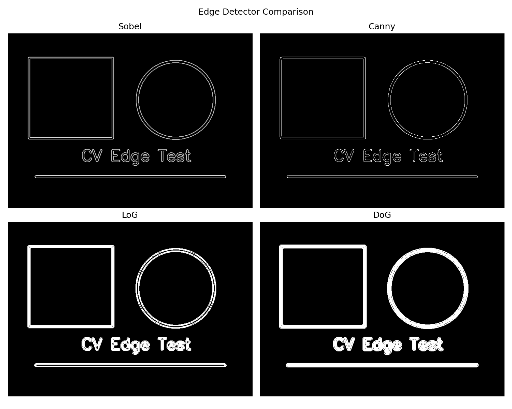
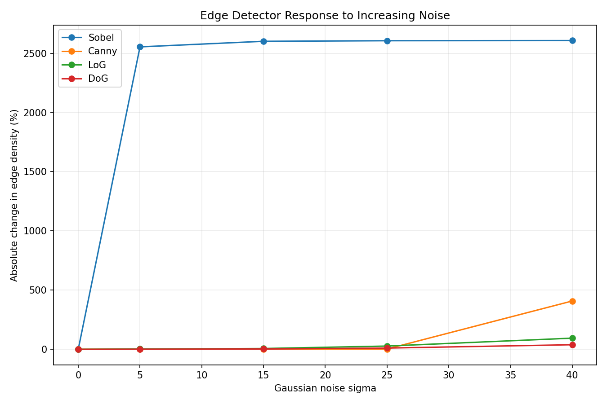

# Project Report
## Edge Detector Comparison & Analysis Tool

### 1. Introduction
Edge detection is a fundamental Computer Vision operation used to identify
locations of significant intensity change in an image. This project compares
four classical methods: Sobel, Canny, Laplacian of Gaussian (LoG), and
Difference of Gaussians (DoG).

### 2. Objectives
1. Implement and compare four edge detectors.
2. Demonstrate convolution using a manual NumPy implementation of Sobel.
3. Observe the effect of increasing Gaussian noise.
4. Record simple quantitative measurements such as runtime and edge density.

### 3. Methodology
The input image is converted to grayscale. Sobel computes horizontal and
vertical intensity gradients using convolution kernels. Canny applies
smoothing, gradient analysis, non-maximum suppression and hysteresis
thresholding. LoG first smooths the image and then applies the Laplacian.
DoG subtracts two differently smoothed versions of the image and thresholds
the resulting response.

For the robustness experiment, Gaussian noise with several sigma values is
added to the grayscale image. Each detector is run on the noisy image.
Runtime, edge density, and the percentage change in edge density relative to
the clean image are recorded in a CSV file.

### 4. Implementation
The implementation is written in Python using NumPy, OpenCV and Matplotlib.
The Sobel convolution is implemented manually with NumPy rather than using a
single OpenCV Sobel call. OpenCV is used for image I/O and the other standard
image-processing operations.

### 5. Results

The experiment was performed on the clean image and on images containing Gaussian noise with sigma values of 5, 15, 25 and 40. Runtime, edge density and percentage change in edge density were recorded for each detector.

For the clean image, the edge densities were approximately 0.0369 for Sobel, 0.0172 for Canny, 0.0708 for LoG and 0.0967 for DoG.

As the noise level increased, the behaviour of the detectors became different. Sobel showed a very large increase in edge density under noise. Its edge density increased from approximately 0.0369 on the clean image to 0.9786 at sigma 5 and reached approximately 0.9982 at sigma 40. This corresponds to a very large percentage change in edge density.

Canny showed comparatively small changes at lower noise levels. Its edge-density change was approximately 1.91% at sigma 5, 1.94% at sigma 15 and 2.51% at sigma 25. However, at sigma 40, the change increased substantially to approximately 407.93%.

LoG showed a gradual increase in edge density as noise increased. Its density-change percentage increased from approximately 2.74% at sigma 5 to 6.98% at sigma 15, 27.52% at sigma 25 and 94.34% at sigma 40.

DoG also showed increasing sensitivity to noise. Its density-change percentage was approximately 1.04% at sigma 5, 2.68% at sigma 15, 10.57% at sigma 25 and 38.74% at sigma 40.

The generated comparison grid provides a visual comparison of Sobel, Canny, LoG and DoG on the clean image. The noise experiment and robustness plot provide a quantitative view of how their edge-density measurements change as Gaussian noise increases.

These results are specific to the selected image and implementation parameters. Edge density is only a simple measurement of detected edges and should not be treated as a direct measure of detection accuracy.

**Figure 1: Comparison of Sobel, Canny, LoG and DoG edge detection methods.**

**Figure 2: Noise robustness analysis at different Gaussian noise levels.**

### 6. Limitations
- Threshold choices affect the appearance of detected edges.
- Edge density is a simple proxy and is not the same as detection accuracy
  against a ground-truth edge map.
- Very noisy or low-contrast images can produce unstable results.
- The manual convolution implementation is intentionally simple and is not
  optimized for speed.

### 7. Conclusion
The project demonstrates how classical edge detection methods differ in
their processing pipelines and responses to image noise. It also connects
theoretical Computer Vision concepts such as convolution, Gaussian
smoothing and Laplacian operators with executable experiments.

### 8. Future Scope
A future version could add ground-truth edge datasets, precision/recall or
F-measure, automatic parameter tuning, and additional detectors.
